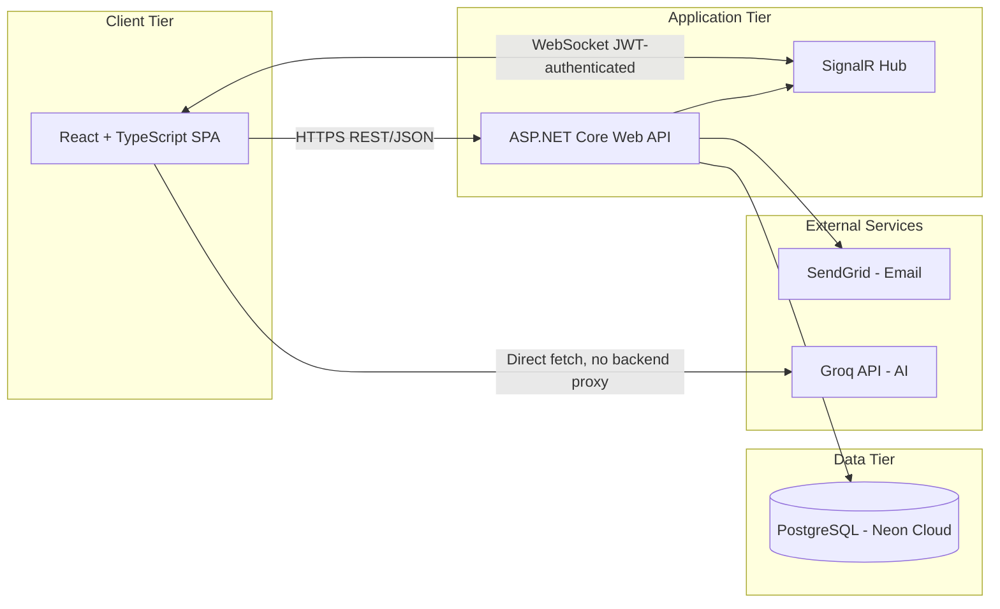
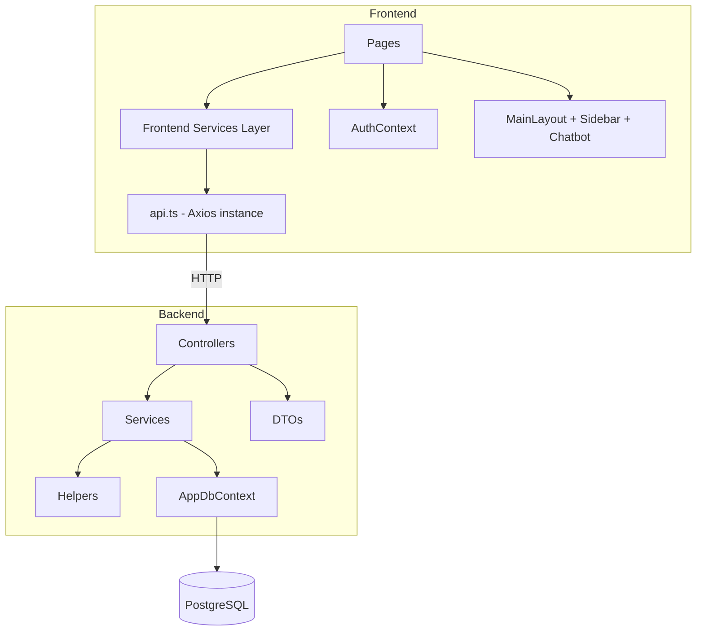
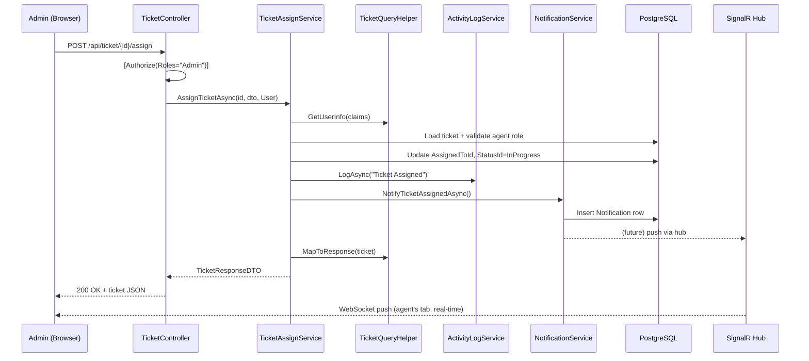
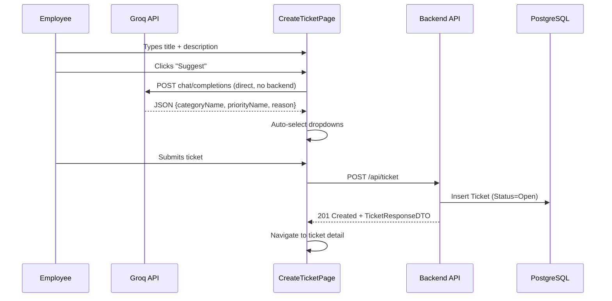
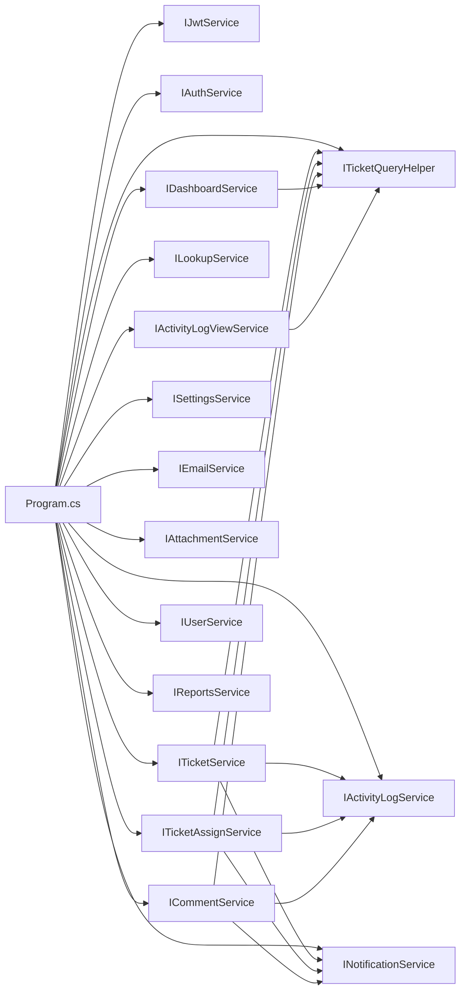

# Architecture Documentation

## Overall Architecture

Three-tier architecture: React SPA (frontend) → ASP.NET Core Web API (backend) → PostgreSQL (Neon Cloud), with two external service integrations (SendGrid for email, Groq for AI) and one real-time channel (SignalR).



**Note:** AI calls (`aiService.ts`) bypass the backend entirely — the frontend calls Groq directly. This was a deliberate simplicity tradeoff; it means the Groq API key lives client-side in `.env`, acceptable for a free-tier internal tool but a documented tradeoff (see `security.md`).

## Component Diagram



## Layered Architecture (Backend)

Strictly enforced, per project convention:

```
Controllers (thin HTTP layer)
      ↓
Services (business logic, RBAC enforcement, orchestration)
      ↓
Helpers (RoleConstants, SeedConstants, StatusTransitionHelper, TicketQueryHelper, FileValidationHelper)
      ↓
AppDbContext (EF Core)
      ↓
PostgreSQL
```

DTOs are split request (IN) vs response (OUT) per domain and cross-cut all layers as data contracts — they are not a "layer" in the vertical sense but a horizontal concern.

## Request Flow (Example: Assign Ticket)



## Data Flow (Ticket Creation with AI)



## Design Decisions

| Decision | Rationale |
|---|---|
| DTOs split IN/OUT per domain | Prevents over-posting attacks, decouples API contract from EF models |
| Fixed GUIDs for seed data (`SeedConstants`) | Guarantees consistent references between code and DB across environments/migrations |
| Status transitions enforced server-side only (`StatusTransitionHelper`) | Prevents workflow bypass even if the UI is tampered with |
| Role claim under `ClaimTypes.Role` (long URI) | Matches ASP.NET Core's default `RoleClaimType` for `[Authorize(Roles=)]` without needing custom `TokenValidationParameters.RoleClaimType` overrides |
| AI calls made frontend → Groq directly | Avoids backend proxy complexity for a free-tier, non-sensitive feature; accepted tradeoff of exposing the API key client-side |
| SignalR JWT via query string | WebSocket protocol cannot carry `Authorization` headers; `OnMessageReceived` event reads `access_token` from the query string instead |
| Soft-delete via status = Closed (not row deletion) | Preserves the audit trail — `ActivityLog` records referencing a ticket must always resolve |

## Architectural Patterns

- **Repository-less EF Core** — `AppDbContext` is injected directly into services (no separate repository abstraction); acceptable at this scale, keeps `TicketQueryHelper` as the sole shared-query surface.
- **Service-per-domain** — one interface + implementation per bounded context (`ITicketService`, `IUserService`, `IReportsService`, etc.), each independently registered in DI.
- **Thin Controller pattern** — controllers validate only input shape/presence; all business rules (role checks, status validation, ownership checks) live in services.
- **CQRS-lite in Reports/Dashboard** — read-only aggregation services (`ReportsService`, `DashboardService`) that never write, separate from the write-heavy `TicketService`.

## Dependency Graph (Backend DI Registrations)



All registered as `Scoped` (per-request lifetime), consistent with EF Core's `AppDbContext` scoping.
