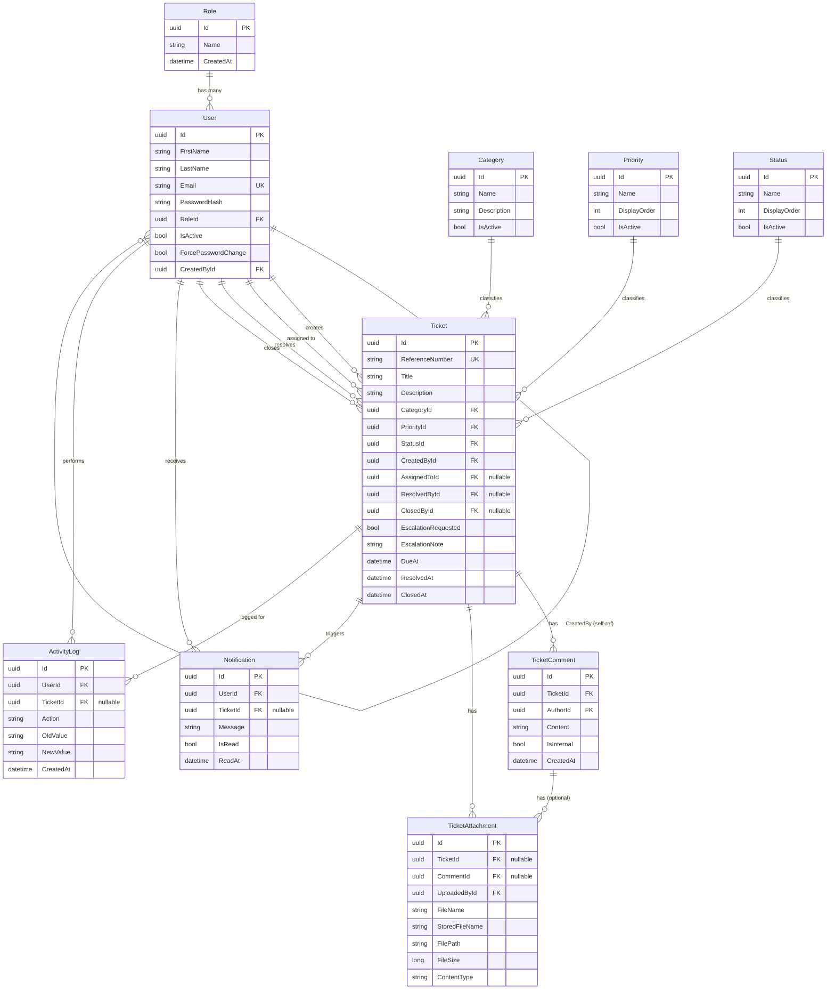

# Database Documentation

## ERD (Mermaid)

## Tables Summary

10 tables total, all PKs `UUID`, all FKs named `[TableName]Id`.

| Table | Purpose |
|---|---|
| `Role` | 4 fixed roles: Admin, ITSupportAgent, Employee, Manager |
| `User` | All accounts — hashed passwords, role assignment, active flag |
| `Category` | Ticket classification (Hardware, Software, Network, Email, Access Request, Other) |
| `Priority` | Urgency levels (Low, Medium, High, Critical) |
| `Status` | Fixed workflow stages (Open, In Progress, Pending, Resolved, Closed) |
| `Ticket` | Core support request record |
| `TicketComment` | Public comments and internal notes |
| `TicketAttachment` | Files linked to a ticket or a specific comment |
| `Notification` | Per-user notification records |
| `ActivityLog` | Append-only audit trail |

## Relationships

- `Ticket` has **four separate FKs to `User`** (CreatedBy, AssignedTo, ResolvedBy, ClosedBy) — all `OnDelete: Restrict` to prevent orphaning history if a user record were ever deleted (in practice, users are soft-disabled via `IsActive`, never hard-deleted).
- `TicketAttachment` can link to **either** a `Ticket` OR a `TicketComment` (both nullable FKs) — allows attaching files directly to a ticket or to a specific comment.
- `ActivityLog.TicketId` is nullable to allow future non-ticket-scoped log entries (e.g. user management actions), though current usage always sets it for ticket actions.

## Indexes & Constraints

- `User.Email` — unique index.
- `Ticket.ReferenceNumber` — unique index.
- Standard FK indexes auto-created by EF Core on every foreign key column (`AssignedToId`, `CategoryId`, `CreatedById`, etc.) as seen in every migration's `CreateIndex` calls.

## Migration Overview

Chronological migrations (per `Migrations/` folder):

1. `InitialCreate` — Roles, Users
2. `SeedRoles` — 4 role rows with fixed GUIDs
3. `SeedAdminUser` — bootstrap admin account
4. `AddTicketModule` / `AddTicketModuleV2` — Categories, Priorities, Statuses, Tickets (+ escalation fields added in V2)
5. `AddActivityLog`
6. `AddTicketComment`
7. `AddNotification`

> **Action item:** No migration for `TicketAttachment` was present in the reviewed migration set. Verify `dotnet ef migrations list` against `Models/TicketAttachment.cs` to confirm parity before relying on this document as a complete migration reference.

Seed data uses **fixed, hardcoded GUIDs** (`RoleConstants`, `SeedConstants`) — never `Guid.NewGuid()` in `HasData()` — to guarantee identical IDs across every environment.

## Seeded Reference Data

**Roles:** Admin, ITSupportAgent, Employee, Manager
**Statuses:** Open → In Progress → Pending/Resolved → Closed
**Priorities:** Low, Medium, High, Critical
**Categories:** Hardware, Software, Network, Email, Access Request, Other
**Bootstrap Admin:** `admin@ids.com` (password set via seed hash, force-change disabled for this account only)
