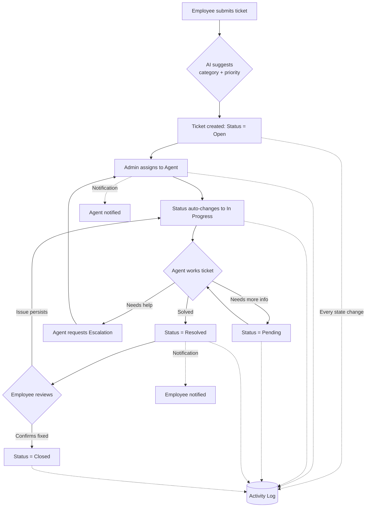

# Project Overview

*Based on actual implementation: HANDOFF.md, backend source (Controllers, Services, DTOs, Models, Helpers, Program.cs), frontend source (pages, services, layouts), and README.md.*

---

## Executive Summary

The **IDS IT Help Desk & Ticketing System** is a full-stack web application built to replace informal, untracked IT support communication (email threads, verbal requests) with a structured, auditable ticketing platform. It was developed as an 8-week internship deliverable at Integrated Digital Systems (IDS) by Jamal Alboukai, supervised by Suha Mneimneh.

The system is a **role-based, real-time IT service management (ITSM) tool** covering the full ticket lifecycle: submission, categorization, assignment, escalation, resolution, and closure — with supporting modules for reporting, auditing, user management, and AI-assisted triage.

---

## Project Purpose

To give an organization (IDS) a single, centralized system where:
- Employees can report IT issues and track their resolution.
- IT Support Agents can manage a queue of assigned work.
- Managers can monitor team performance without operational access.
- Administrators can control the full system — users, ticket assignment, and configuration.

---

## Business Problem

Prior to this system, the described pain points (per project handoff and requirements) were:

- IT requests submitted via informal channels (email/chat) with no central tracking.
- No accountability — no record of who is responsible for an open issue or how long it has been open.
- No prioritization — all requests treated identically regardless of urgency.
- No visibility for management into team workload, bottlenecks, or resolution speed.
- No audit trail — disputes or reviews had no historical record to draw on.

---

## Solution

A single web application with:

- **Strict role-based access control (RBAC)** enforced at both the API and UI layer, so each of four roles only sees and can act on what's relevant to them.
- **A fixed, enforced ticket status workflow** (`Open → In Progress → Pending/Resolved → Closed`) preventing steps from being skipped.
- **A complete audit trail** — every state change, assignment, and comment is permanently logged.
- **Real-time notifications** via WebSockets (SignalR) so status changes are seen instantly without refreshing.
- **AI-assisted triage** — ticket category and priority are auto-suggested from free-text descriptions, and a chatbot assists with general IT questions.
- **Manager/Admin reporting** — monthly summaries and agent performance metrics, exportable to PDF/Excel.

---

## Features

Grouped by functional area, based on the implemented codebase:

### Authentication & Identity
- JWT-based authentication with BCrypt password hashing.
- Forced password change on first login for newly created accounts.
- Role claim embedded directly in the JWT (`ClaimTypes.Role`), consumed by both ASP.NET Core's `[Authorize(Roles=)]` attribute and the React `AuthContext`.

### Ticket Management
- Full CRUD with role-scoped visibility (`TicketService.GetTicketsAsync`, `GetTicketByIdAsync`).
- Auto-generated sequential reference numbers (`TKT-0001` format).
- Category, Priority, and Status classification (all backed by dedicated lookup tables).
- Due date tracking.
- Enforced status transition rules (`StatusTransitionHelper`).
- Assignment and reassignment (Admin-only), including automatic status transition to `In Progress` on assignment.
- Escalation workflow (Agent-initiated, with a note; cleared automatically on reassignment).

### Communication
- Public comments (visible to all ticket participants).
- Internal notes (visible only to Agents and Admins — hidden from Employees and Managers).
- File attachments with content-based (magic byte) validation, not just extension/MIME checking (`FileValidationHelper`).

### Notifications
- In-app notification center with unread count badge.
- Real-time push via SignalR (`NotificationHub`), authenticated over WebSocket using the JWT passed as a query parameter.
- Email notifications via SendGrid for key events (assignment, resolution, password changes).

### AI Features
- AI-assisted category/priority suggestion on ticket creation, calling a free LLM (Groq — `llama-3.3-70b-versatile`) directly from the frontend.
- Floating chatbot assistant, available on every page, providing general IT support guidance with short conversational memory (last 6 messages).
- *Note: The system originally attempted Google Gemini, but that provider's free tier proved unavailable in the deployment region (Lebanon); the implementation was switched to Groq.*

### Reporting & Analytics
- Role-scoped dashboard with KPI cards and charts (status/priority/category breakdown, 7-day ticket volume trend) via Recharts.
- Monthly ticket summary and agent performance reports.
- Export to Excel (two-sheet workbook via SheetJS/`xlsx`) and PDF (browser print with dedicated print stylesheet).

### Administration
- User management — create, edit, activate/deactivate accounts, assign roles.
- Settings management — add/edit/deactivate Categories and Priorities (Statuses are fixed and read-only, since the workflow is hardcoded).
- Global Activity Log — full audit trail, role-scoped (Agents see only logs tied to their assigned tickets), filterable by user, action type, and date range.

### User Profile
- Available to all roles — view own details, edit first/last name, change password inline (with password strength indicator), initials-based avatar.

### Cross-Cutting
- Fully responsive layout (mobile, tablet, desktop) — collapsible sidebar, adaptive tables (`overflow-x-auto`, hidden secondary columns on small screens), stacking chart/grid layouts.

---

## Target Users

| Role | Description | Primary Use |
|---|---|---|
| **Employee** | General staff member | Submit and track their own IT tickets |
| **IT Support Agent** | Technical support staff | Work assigned tickets through to resolution |
| **Manager** | Team oversight, no operational access | Monitor performance and reports (read-only on tickets) |
| **Admin** | System administrator | Full control — user management, assignment, configuration, reporting |

---

## High-Level Workflow

---

## Screenshots

*(Placeholders — to be filled with actual application screenshots before final publication)*

- ``
- ``
- ``
- ``
- ``
- ``
- ``
- ``

---

## Glossary

| Term | Definition |
|---|---|
| **Ticket** | A single support request record, uniquely identified by a reference number (e.g. `TKT-0001`) |
| **Status** | The current stage of a ticket in its fixed workflow: Open, In Progress, Pending, Resolved, Closed |
| **Priority** | Urgency classification: Low, Medium, High, Critical |
| **Category** | Type classification: Hardware, Software, Network, Email, Access Request, Other |
| **Escalation** | An Agent's formal request to have a ticket reassigned/reviewed, with a note explaining why |
| **Internal Note** | A comment on a ticket visible only to Agents and Admins, hidden from Employees/Managers |
| **RBAC** | Role-Based Access Control — restricting actions and visibility according to the logged-in user's role |
| **JWT** | JSON Web Token — the signed credential issued at login, carrying identity and role claims |
| **DTO** | Data Transfer Object — a shape-specific object used to move data between layers/API boundary without exposing internal models |
| **SignalR** | Microsoft's real-time communication library used here for instant notification delivery over WebSockets |
| **Activity Log** | The permanent, append-only audit trail recording every significant action taken in the system |
| **Lookup table** | A small reference table (Category, Priority, Status, Role) used to populate dropdowns and enforce valid values via foreign keys |
